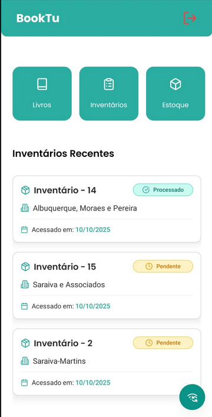

# BookTu App

Sistema mobile de gerenciamento de inventário de livros desenvolvido com React Native e Expo, projetado para funcionar tanto online quanto offline.

## 📋 Sobre o Projeto

BookTu é uma aplicação mobile que permite gerenciar inventários de livros em estabelecimentos, com suporte completo para operação offline. O aplicativo sincroniza dados quando conectado à internet e armazena informações localmente para acesso sem conexão.

## ✨ Funcionalidades Principais

### 🔐 Autenticação

- Login seguro com validação de credenciais
- Persistência de sessão
- Alerta quando offline impede login

### 📚 Gestão de Livros

- Listagem de livros com paginação infinita
- Busca por título, autor ou identificador
- Filtros múltiplos (A-Z, Z-A, preço, data de lançamento)
- Visualização detalhada de cada livro
- Cache local para acesso offline
- Sincronização individual ou em lote

### 📦 Gestão de Inventários

- Criação de inventários online e offline
- Edição de inventários existentes
- Visualização detalhada com informações do estabelecimento
- Processamento de inventários
- Sincronização de inventários offline
- Histórico dos últimos 3 inventários acessados
- Validação de erros em inventários offline

### 📊 Controle de Estoque

- Visualização de itens em estoque
- Filtro por estabelecimento
- Busca por livros
- Quantidade total de unidades

### 🔄 Sincronização

- Menu dedicado de sincronização
- Sincronização automática a cada 1 hora
- Sincronização manual de:
  - Todos os livros
  - Estabelecimentos
  - Livros individuais
  - Inventários offline
- Contador visual para próxima sincronização
- Tratamento de erros de sincronização

### 📱 Modo Offline

- Criação de inventários offline
- Edição de inventários offline
- Visualização de livros em cache
- Alertas visuais de status offline
- Sincronização inteligente ao conectar

## 🛠 Tecnologias Utilizadas

- **React Native** - Framework mobile
- **Expo** - Plataforma de desenvolvimento
- **TypeScript** - Tipagem estática
- **React Navigation** - Navegação entre telas
- **TanStack Query** - Cache e sincronização de dados
- **React Hook Form** - Gerenciamento de formulários
- **Zod** - Validação de schemas
- **AsyncStorage** - Persistência local de dados
- **NativeWind** - Tailwind CSS para React Native
- **Gluestack UI** - Componentes base
- **Lucide React Native** - Ícones
- **React Native Reanimated** - Animações
- **React Native Gesture Handler** - Gestos
- **Axios** - Cliente HTTP
- **NetInfo** - Detecção de conectividade
- **Expo Fonts** - Fontes personalizadas (Inter, Poppins)

## 📁 Estrutura do Projeto

```
src/
├── components/         # Componentes reutilizáveis
├── contexts/           # Contextos React (Auth, Toast, NetInfo)
├── env/                # Configurações de ambiente
├── hooks/              # Hooks personalizados
├── lib/                # Configurações de bibliotecas
├── routes/             # Configuração de rotas
├── screens/            # Telas da aplicação
├── shared/types/       # Definições TypeScript
├── storage/            # Gerenciamento AsyncStorage
├── useCases/           # Hooks de API
└── utils/              # Funções utilitárias
```

## 🗄️ Estrutura de Armazenamento de Dados

### AsyncStorage Keys

- `@booktu:token` - Token de autenticação
- `@booktu:books` - Cache de livros
- `@booktu:establishments` - Cache de estabelecimentos
- `@booktu:offline_inventory` - Inventários criados offline
- `@booktu:inventory_history` - Histórico de inventários acessados
- `@booktu:refetch_timestamp` - Timestamp para sincronização automática

### Fluxos Principais

#### Criação de Inventário

1. **Online**: Envia diretamente para API
2. **Offline**: Salva localmente com `temporary_id`
3. **Sincronização**: Valida e envia inventários offline quando conecta

#### Sincronização

1. Verifica conectividade
2. Busca dados da API
3. Atualiza cache local
4. Define próximo timestamp (1 hora)
5. Valida inventários offline contra dados atualizados

#### Validação de Inventários Offline

- Verifica se livros ainda existem
- Verifica se estabelecimento ainda existe
- Marca erros por tipo (book/establishment)
- Bloqueia sincronização se houver erros

## 📱 Recursos de UX

- **Loading States**: Spinners em operações assíncronas
- **Pull to Refresh**: Atualização de listas
- **Infinite Scroll**: Paginação automática
- **Swipe to Delete**: Gesto para remover itens
- **Skeleton Loaders**: Carregamento progressivo
- **Toast Notifications**: Feedback de ações
- **Offline Indicators**: Alertas visuais de conectividade
- **Animations**: Transições suaves com Reanimated

## 🔒 Segurança

- Token JWT armazenado localmente
- Validação de formulários com Zod
- Axios interceptors para autenticação
- Limpeza de sessão ao deslogar offline

## 📊 Performance

- **Paginação**: Queries com infinite scroll
- **Cache**: TanStack Query com stale time
- **Debounce**: Busca com delay de 500ms
- **Lazy Loading**: Componentes carregados sob demanda
- **Memoization**: useMemo e useCallback em operações pesadas

## 🚀 Como Executar

### Pré-requisitos

- Node.js (v16 ou superior)
- pnpm, yarn ou npm
- Expo CLI
- Android Studio ou Xcode (para emuladores)

### Instalação

```bash
# Clone o repositório
git clone https://github.com/Yan-CarlosIF/BookTu-App

# Entre na pasta
cd BookTu-App

# Instale as dependências
npx expo install
```

### Executar

```bash
# Iniciar o Expo
npm start
# ou
yarn start

# Para Android
npm run android
# ou
yarn android

# Para iOS
npm run ios
# ou
yarn ios

# Para Web
npm run web
# ou
yarn web
```

## Screenshots 📸

|                  Tela Home                  |                 Tela de Inventários                 |
| :-----------------------------------------: | :-------------------------------------------------: |
|  |  |
